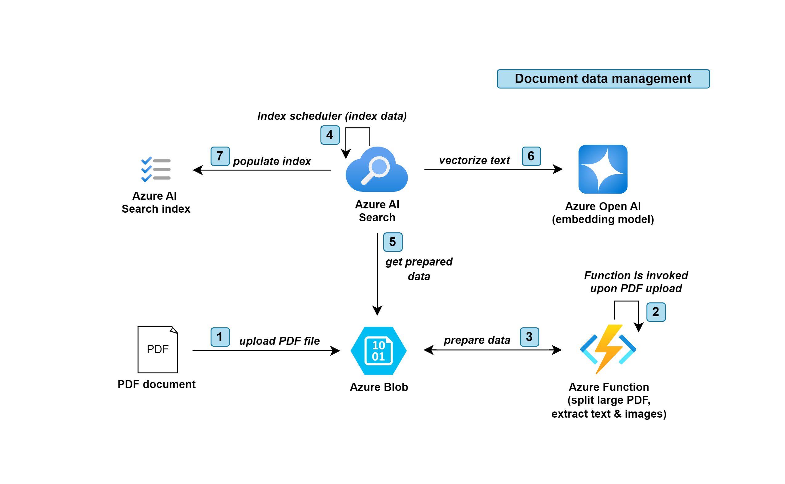
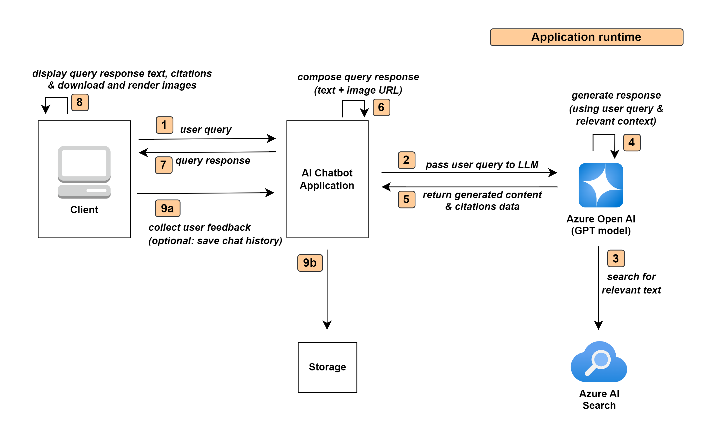

# GenAI RAG with On-Your-Data (OYD) text and images scenario

This repository focuses on highlighting the key areas how to approach building a solution for a use case of GenAI application that lets end-users ask questions about company's owned documentation that have images and diagrams. The end-user will receive the response to their question in text and images and diagrams whenever such exist on the subject being chatted about.

## Content
- [Overview](#overview)
- [Reference architecture](#reference-architecture)
  - [Document data management](#document-data-management)
  - [Application runtime](#application-runtime)
  - [Azure Blob directory and file structure](#azure-blob-directory-and-file-structure)
- [Infrastructure deployment](#infrastructure-deployment)
  - [Prerequisites](#prerequisites)
  - [Deployment](#deployment)
    - [Option 1: Quick-deploy and start testing the demo app](#option-1)
    - [Option 2 (Recommanded): Follow step-by-step to gain better understanding of moving parts](#option-2)
    - [Cleanup](#cleanup)
  - [Extending deployment with your own documents](#extending-deployment-with-your-own-documents)
  
## Overview

This repository is broken down in following sections (click at the hyperlink of each section for further details):

| Section | Description |
| --- | --- |
| [Azure Function](azure-function) | Focuses on processing the raw PDF files by chunking the text and extracting the images as illustrated in the [reference architecture](README.md#document-data-management) below. |
| [Azure AI Search](azure-ai-search) | Focuses on configuring the `index`, `indexer`, and `skillset`. AI Search is using the processed data by Azure Function and populate the index. |
| [Demo application](demo-app) | Showcases an end-to-end demo as illustrated in the [reference architecture](README.md#application-runtime) below. |
| [Demo with notebook code](demo-notebook) | Illustrates a simplified version of end-to-end representing the client/server components. |
| [Azure Bicep](bicep) | Infrastructure code to deploy the solution |


## Reference architecture

### Document data management




### Application runtime




### Azure Blob directory and file structure


## Infrastructure deployment

### Prerequisites

+ [Azure subscription](https://azure.microsoft.com/free/)
+ [Azure CLI](https://learn.microsoft.com/cli/azure/install-azure-cli)
+ Permission to create and access resources in Azure
+ [Docker](https://docs.docker.com/engine/install/)
+ If you're on Windows, [WSL](https://learn.microsoft.com/en-us/windows/wsl/install) with [Ubuntu distro](https://documentation.ubuntu.com/wsl/en/latest/guides/install-ubuntu-wsl2/), and [Azure CLI](https://learn.microsoft.com/cli/azure/install-azure-cli) to also be installed inside Ubuntu
+ Azure Open AI chat and embedding models deployed

#### Login into your Azure Tenant  
`az login --tenant "your-tenant-id-here"`

#### Creating config file
For Azure AI Search to be configured connrectly, and demo app to work, we first need to create a configuration file that will storage needed information about your deployed Azure Open AI chat and embedding models.

`Note`: This solution was developed and tested using `gpt-4o` as the chat model, and `text-embedding-ada-002` as the embedding model. Alternative models are likely to work too, but for the best experience, we recommend using the same models whenever possible.

`Note`: If you don't have the models deployed, you can follow the [create and deploy an Azure OpenAI Service resource](https://learn.microsoft.com/en-us/azure/ai-services/openai/how-to/create-resource?pivots=web-portal) guide to do so.

Create `.env_aoai` file in root directory of this repository. Following are the variables that need to be set, with example valies.

You can referr to [demo application](demo-app) section for guidance on where to obtain each of the values.

```bash
AZURE_OPENAI_ENDPOINT=https://my-domain-name.openai.azure.com/
AZURE_OPENAI_KEY=my-azure-open-ai-key
AZURE_OPENAI_CHATGPT_DEPLOYMENT=my-gpt-deployment-name
AZURE_OPENAI_API_VERSION=2024-04-01-preview
AZURE_OPENAI_CHATGPT_EMBEDDING_DEPLOYMENT=my-gpt-deployment-embedding-model-name
AZURE_OPENAI_CHATGPT_EMBEDDING_MODEL_NAME=text-embedding-ada-002
```

### Deployment

There are two option running through the deployment:
- **Option 1**: You want all the deployment to be seemless in background and go straight to testing the solution using the demo app.
- **Option 2** (Recommanded): You want to go step-by-setp to gain better understanding what's invloved in setting up the solution, and only after running the demo app.


`Note`: A helper bash script will be used to deploy all part. You can use the `-x` bash option if you'd like to see more details of what's being executed. Example: `bash -x ./helper.sh test`

#### Option 1

1. Build docker image, run the container and exec  
`bash ./helper.sh docker-up`

2. Deploy the solution (might take ~10min to complete)  
`bash ./helper.sh deploy`

3. Try the demo app  
Open the demo app in your browser `http://localhost:8501`. In chat window, type `Tell me about Kubernetes.`


#### Option 2

1. Build docker image with all required dependencies 
`bash ./helper.sh docker-build`

2. Run docker container

The container will:
  - Mount a volume with azure cli dir (aka `~/.azure`), to use azure credentials for Azure resource deployment
  - Mount a volume of this repository
  - Bind port 8501 to access the demo app
  
`bash ./helper.sh docker-run`

1. Attach bash to container in interactive mode  
`bash ./helper.sh docker-exec`

2. Create Azure resource group  
`bash ./helper.sh create-resource-group`

3. Deploy infrastructure  
`bash ./helper.sh deploy-bicep`

4. Create .env file using bicep outputs  
`bash ./helper.sh create-dot-env`

5. Configure the deployed Azure AI Search service  
Create data source, index, skillset, and indexer.  
`bash ./helper.sh setup-ai-search`

6.  Deploy Azure Function code  
`bash ./helper.sh deploy-function`

7. Upload sample PDF document  
Sample document is used that's located in `./sample-documents` directory. It's a few-page document from Azure ASK document.  
`bash ./helper.sh upload-pdf`  

`Note`: Before executing the next command, please wait about 60 seconds for Azure Function to prepare the uploaded PDF document, so it's ready to be indexed by Azure AI Search indexer.

8.  Run Azure AI Search indexer to populate the index  
`bash ./helper.sh run-indexer`

9.  Create .env file for the demo app  
`bash ./helper.sh create-dot-env-demo-app`

10.  Install demo app python dependencies  
`bash ./helper.sh install-demo-app-dependencies`

11.  Run the demo app  
`bash ./helper.sh run-demo-app`


#### Cleanup

1. Delete all deployed Azure resources  (`Note`: To be executed from within the container)  
`bash ./helper.sh cleanup`

2. Stop and remove docker container 
First, exit the docker container by typing `exit` and **hit return** in the terminial, and after run the command below.  
`bash ./helper.sh docker-container-stop-remove`

3. Delete docker image  
`bash ./helper.sh docker-remove-image`

### Extending deployment with your own documents

You can easily expend this solution to test it on your own documents in just few steps.

1. Prepare the document  
Copy your document into the `./sample-documents` directory.

2. Upload the document to your Azure Blob storage that was provisioned as part of the infrastructure deployment  
`file_name="myfile.pdf" bash ./helper.sh upload-pdf`

3. Run Azure AI Search indexer to index your document  
`bash ./helper.sh run-indexer`

Congratulations! You can use the demo app to ask questions about your own document.
