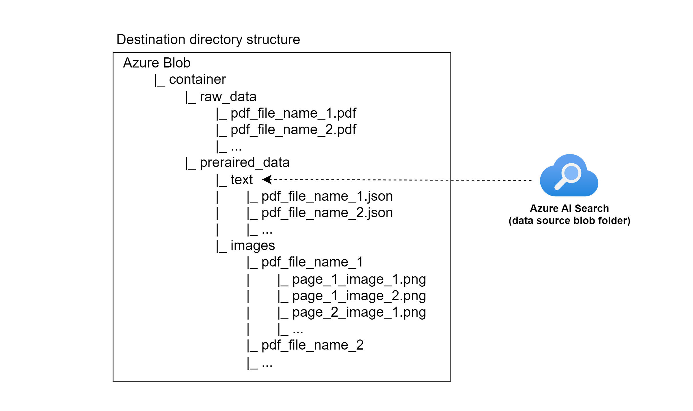

# RAG on PDF with text and embedded Images, with citations referencing image answering user query

## Content
- [Overview](#overview)
- [Workshop: In-depth learning by using self-paste workshop](https://azure-samples.github.io/azure-open-ai-rag-oyd-text-images/)
- [Reference architecture](#reference-architecture)
  - [Document data management](#document-data-management)
  - [Application runtime](#application-runtime)
  - [Azure Blob directory and file structure](#azure-blob-directory-and-file-structure)
- [Infrastructure deployment](#infrastructure-deployment)
  - [Prerequisites](#prerequisites)
  - [Deployment](#deployment)
    - [Option 1: Quick-deploy and start testing the demo app](#option-1)
    - [Option 2 (Recommanded): Follow step-by-step to gain better understanding of moving parts](#option-2)
    - [Cleanup](#cleanup)
  - [Extending deployment with your own documents](#extending-deployment-with-your-own-documents)
  
## Overview

In today's era of Generative AI, customers can unlock valuable insights from their unstructured or structured data to drive business value. By infusing AI into their existing or new products, customers can create powerful applications, which puts the power of AI into the hands of their users. For these [Generative AI](https://learn.microsoft.com/en-us/azure/developer/ai/introduction-build-generative-ai-solutions) applications to work on customers data, implementing efficient [RAG](https://learn.microsoft.com/en-us/azure/developer/ai/augment-llm-rag-fine-tuning) (Retrieval augment generation) solution is key to make sure the right context of the data is provided to the LLM based on the user query.  

Customers have PDF documents with text and embedded figures which could be images or diagrams holding valuable information that they would like to use as a context to the LLM to answer a given user query. Parsing those PDFs to implement an efficient RAG solution is challenging, especially when the customer wants to maintain the relationship between the text and extracted image context used to answer the user query. Also, referencing the image as part of the citation which answers the user query is also challenging if the images are not extracted and are retrievable. This blog post addressing the challenge of extracting PDF content with text and images as part of the RAG solution, where the relationship between the searchable text context with any of its extracted images is maintained so that the images can be retrieved as references within the citations.  

Below we outline a simple architecture to build a RAG application on PDF data, where the extracted image content within the PDF is also retrievable as part of the LLM output as part of citation references. 

This repository is broken down in following sections (click at the hyperlink of each section for further details):

| Section | Description |
| --- | --- |
| [Azure Function](azure-function) | Focuses on processing the raw PDF files by chunking the text and extracting the images as illustrated in the [reference architecture](README.md#document-data-management) below. |
| [Azure AI Search](azure-ai-search) | Focuses on configuring the `index`, `indexer`, and `skillset`. AI Search is using the processed data by Azure Function and populate the index. |
| [Demo application](demo-app) | Showcases an end-to-end demo as illustrated in the [reference architecture](README.md#application-runtime) below. |
| [Demo with notebook code](demo-notebook) | Illustrates a simplified version of end-to-end representing the client/server components. |
| [Azure Bicep](bicep) | Infrastructure code to deploy the solution |


## Reference architecture

This section includes three diagrams:

- [Document Data Management](#document-data-management): This diagram illustrates the process from PDF upload and vectorization to data being indexed in Azure AI Search, making it ready to handle query requests.
- [Application Runtime](#application-runtime): This diagram outlines the complete flow of user requests and responses.
- [Azure Blob Directory and File Structure](#azure-blob-directory-and-file-structure): This diagram shows how data is organized in Azure Blob.


### Document data management


The document data management flow operates as follows:

1. A raw PDF document file is uploaded to Azure Blob storage.
2. An event trigger in Azure Blob invokes an Azure Function, which then splits large PDFs, extracts text chunks, and maps images to the corresponding text chunks.
3. Once the Azure Function prepares the data, it uploads the prepaired data back to Azure Blob storage.
4. An index scheduler is then invoked to initiate the indexing process for the prepared data.
5. The prepared data is retrieved from Azure Blob by Azure AI Search.
6. Azure AI Search processes the text chunks in parallel, using the Azure OAI embedding model to vectorize the text.
7. The Azure AI Search index is populated with the prepared data and vectorized chunks. Additionally, it maps the relevant images to their corresponding text chunks using a custom index field.

### Application runtime


The application runtime flow operates as follows:

1. User makes a query request through the client-side application.
2. The server-side AI chatbot application forwards the user's query to Azure OAI. Note: This step is an ideal point to implement controls such as safety measures using the [Azure AI Content Safety](https://azure.microsoft.com/en-us/products/ai-services/ai-content-safety) service.
3. Azure OAI, given the user's query, makes a request to Azure AI Search to retrieve relevant text and images. Notably, the responsibility for making the request to Azure AI Search shifts from the application code to the AIAO service itself.
4. With the user's query and the relevant text retrieved from Azure AI Search, AIAO generates the response.
5. AIAO returns the generated response and associated metadata (e.g., citation data) to the server-side AI chatbot application.
6. The server-side AI chatbot application remaps the response data, creating a payload that includes text and image URLs. This step is another excellent point to implement additional controls before sending the payload back to the client-side application.
7. The server-side AI chatbot application sends the response to the user's query back to the client-side application.
8. The client-side application displays the generated response text and downloads any images from Azure Blob, rendering them in the user interface.

`Note`: Steps 9a and 9b are conceptual components of the reference architecture but are not currently part of the deployable artifact. We welcome your feedback and may potentially extend the implementation to include these steps.

### Azure Blob directory and file structure



The directory and file structure serve the following primary purposes:

- **Azure Function**: To retrieve raw PDF files and upload the prepared data back. The event trigger is configured to receive events under the `raw_data` directory.
- **Azure AI Search**: To download the prepared data for populating the index. The Azure AI Search data source is configured to retrieve data from the `prepared_data` directory.


## Infrastructure deployment

### Prerequisites

+ [Azure subscription](https://azure.microsoft.com/free/)
+ [Azure CLI](https://learn.microsoft.com/cli/azure/install-azure-cli)  
  `Note`: Ensure the az bicep extension is installed. You can install it by running `az bicep install`
+ Permission to create and access resources in Azure
+ [Docker](https://docs.docker.com/engine/install/)
+ If you're on Windows, [WSL](https://learn.microsoft.com/en-us/windows/wsl/install) with [Ubuntu distro](https://documentation.ubuntu.com/wsl/en/latest/guides/install-ubuntu-wsl2/), [Azure CLI](https://learn.microsoft.com/cli/azure/install-azure-cli) and [Docker](https://docs.docker.com/engine/install/ubuntu/) to also be installed inside Ubuntu
+ Azure Open AI chat and embedding models deployed  
  `Note`: If you don't have the models deployed, you can follow the [create and deploy an Azure OpenAI Service resource](https://learn.microsoft.com/en-us/azure/ai-services/openai/how-to/create-resource?pivots=web-portal) guide to do so.  
  `Note`: This solution was developed and tested using `gpt-4o` as the chat model, and `text-embedding-ada-002` as the embedding model. Alternative models are likely to work too, but for the best experience, we recommend using the same models whenever possible.

#### Login into your Azure Tenant  
`az login --tenant "your-tenant-id-here"`

#### Git clone
Clone or download this repo and cd into project's root directory.

#### Creating config file
For Azure AI Search to be configured connrectly, and demo app to work, we first need to create a configuration file that will have required information about your deployed Azure Open AI chat and embedding models.

Create `.env_aoai` file in root directory of this repository. Following are the variables that need to be set, with example values.

You can referr to [demo application](demo-app) section for guidance on where to obtain each of the values.

```bash
AZURE_OPENAI_ENDPOINT=https://my-domain-name.openai.azure.com/
AZURE_OPENAI_KEY=my-azure-open-ai-key
AZURE_OPENAI_CHATGPT_DEPLOYMENT=my-gpt-deployment-name
AZURE_OPENAI_API_VERSION=2024-04-01-preview
AZURE_OPENAI_CHATGPT_EMBEDDING_DEPLOYMENT=my-gpt-deployment-embedding-model-name
AZURE_OPENAI_CHATGPT_EMBEDDING_MODEL_NAME=text-embedding-ada-002
```

### Deployment

There are two option running through the deployment:
- **Option 1**: You want all the deployment to be seemless in background and go straight to testing the solution using the demo app.
- **Option 2** (Recommanded): You want to go step-by-setp to gain better understanding what's invloved in setting up the solution, and only after running the demo app.


`Note`: A helper bash script will be used to deploy all parts. You can use the `-x` bash option if you'd like to see more details of what's being executed. Example: `bash -x ./helper.sh test`

#### Option 1

1. Build docker image, run the container and exec  
`bash ./helper.sh docker-up`

2. Deploy the solution (might take ~10min to complete)  
`bash ./helper.sh deploy`

3. Try the demo app  
Open the demo app in your browser `http://localhost:8501`. In chat window, type `Tell me about Kubernetes.` You should see a response and an overall demo app UI view similar to the image below.

<p align="center">
    
</p>


#### Option 2

1. Build docker image with all required dependencies  
`bash ./helper.sh docker-build`

2. Run docker container  
`bash ./helper.sh docker-run`

The container will:
  - Mount a volume with azure cli dir (aka `~/.azure`), to use azure credentials for Azure resource deployment
  - Mount a volume of this repository
  - Bind port 8501 to access the demo app

3. Attach bash to container in interactive mode  
`bash ./helper.sh docker-exec`

4. Create Azure resource group  
`bash ./helper.sh create-resource-group`

5. Deploy infrastructure  
`bash ./helper.sh deploy-bicep`

6. Create .env file using bicep outputs  
`bash ./helper.sh create-dot-env`

7. Configure the deployed Azure AI Search service  
Create data source, index, skillset, and indexer.  
`bash ./helper.sh setup-ai-search`

8.  Deploy Azure Function code  
`bash ./helper.sh deploy-function`

9. Upload sample PDF document  
Sample document is used that's located in `./sample-documents` directory. It's a few-page document from Azure ASK document.  
`bash ./helper.sh upload-pdf`  

`Note`: Before executing the next command, please wait about 60 seconds for Azure Function to prepare the uploaded PDF document, so it's ready to be indexed by Azure AI Search indexer.

10.  Run Azure AI Search indexer to populate the index  
`bash ./helper.sh run-indexer`

11.  Create .env file for the demo app  
`bash ./helper.sh create-dot-env-demo-app`

12.  Install demo app python dependencies  
`bash ./helper.sh install-demo-app-dependencies`

13.  Run the demo app  
`bash ./helper.sh run-demo-app`

14. Try the demo app  
Open the demo app in your browser `http://localhost:8501`. In chat window, type `Tell me about Kubernetes.` You should see a response and an overall demo app UI view similar to the image below.

<p align="center">
    
</p>

#### Cleanup

1. Delete all deployed Azure resources  (`Note`: To be executed from within the container)  
`bash ./helper.sh cleanup`

2. Stop and remove docker container 
First, exit the docker container by typing `exit` and **hit return** in the terminial, and after run the command below.  
`bash ./helper.sh docker-container-stop-remove`

3. Delete docker image  
`bash ./helper.sh docker-remove-image`

### Extending deployment with your own documents

You can easily expend this solution to test it on your own documents in just few steps.

1. Prepare the document  
Copy your document into the `./sample-documents` directory.

2. Upload the document to your Azure Blob storage that was provisioned as part of the infrastructure deployment  
`file_name="myfile.pdf" bash ./helper.sh upload-pdf`

3. Run Azure AI Search indexer to index your document  
`bash ./helper.sh run-indexer`

Congratulations! You can now use the demo app to ask questions about your own document.
