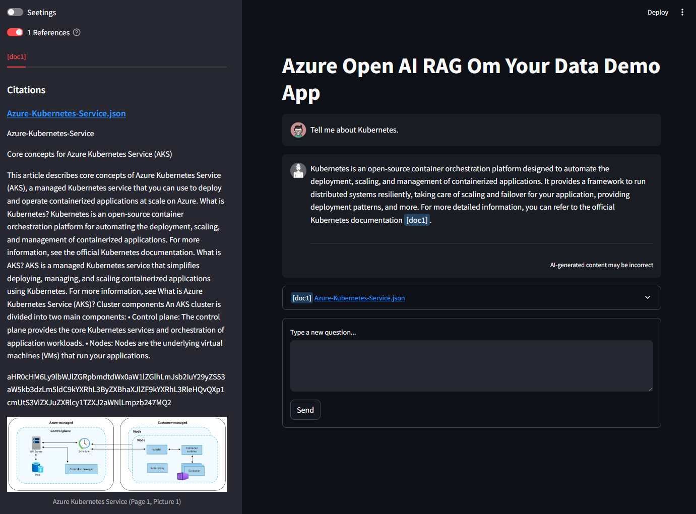

Run the demo as client/server application.

## Setup

### 1. Install python dependencies
Install demo python dependencies.

```bash
pip install -r ./requirements.txt
```

### 2. Configure environment variables
Ensure your infrastructure is deployed. Configure the environment variables by making a copy of the `.env.example` file and rename the copied file to `.env`. 

Following are the environment variables you need to set before being able to run the application successfully:

| Environment Variables | Description |
| ----------- | ----------- |
| `AZURE_OPENAI_ENDPOINT`      | You'll find the endpoint URL under `Azure AI service resource` -> `Resource Management` -> `Keys and Endpoint`. <br><br>    |
| `AZURE_OPENAI_KEY` | You'll find the keys under `Azure AI service resource` -> `Resource Management` -> `Keys and Endpoint`. <br><br>  |
| `AZURE_OPENAI_CHATGPT_DEPLOYMENT` |  You'll find the Azure OAI deployment name under `Azure OpenAI Studio` -> `Deployments` -> `Deployment name`. <br><br> `Note`: It must be a `gpt` type of model under the `Model name`. <br><br>  |
| `AZURE_OPENAI_API_VERSION` | Refer to the [Azure OpenAI Service REST API reference](https://learn.microsoft.com/en-us/azure/ai-services/openai/reference) to find latest supported version. The version used as of this document creation is `2024-04-01-preview`. |
| `AZURE_OPENAI_CHATGPT_EMBEDDING_DEPLOYMENT` | You'll find the Azure OAI embedding deployment name under `Azure OpenAI Studio` -> `Deployments` -> `Deployment name`. <br><br> `Note`: It must be a `text-embedding` type of model under the `Model name`. <br><br>  |
| `SEARCH_ENDPOINT` | You'll find the Azure AI search endpoint URL under `Azure AI service resource` -> `Overview` -> `URL`. <br><br>  |
| `SEARCH_INDEX` | You'll find the Azure AI search index under `Azure AI service resource` -> `Search management` -> `Indexes`. <br><br>  |
| `SEARCH_API_KEY` | You'll find the endpoint URL under `Azure AI service resource` -> `Settings` -> `Keys`. <br><br>  |
| `SEARCH_SEMANTIC_CONFIGURATION` |  You'll find the Azure AI search semantic configuration name under -> `Azure AI service resource` -> `Search Management` -> `Indexes`. Click at your index to open the index configuration view. In the configuration view, click `semantic configurations`. <br><br>  |
| `BLOB_SAS_TOKEN` | You can generate the Azure Blob SAS token under `Azure Storage accounts resource` -> `Data storage` -> `Containers`. Click at the setting button (three dots) and click `Generate SAS`. Configure the scope of the token and click `Generate SAS token and URL`. <br><br>  <br><br> Once generated, you will see `Blob SAS token`, this is the token to be used for this environment variable. <br><br>  |

## Run the demo application
The app is build using the [streamlit framework](https://streamlit.io/). Since all python dependencies are installed, you're ready to run it. To run the app, execute the following command in your terminal:

```
streamlit run ./app.py
```

You should see the URL printed in your terminal. Use this URL in your browser to access the application. By default the URL should be `http://localhost:8501`. 

When you request the URL in your browser, you should see a chat window as depicted in the image below.

<p align="center">
    
</p>

Click the `Settings` button to open the configuration options such as `System Prompt`, `Azure Open AI`, and `Azure AI Search`.

<p align="center">
    
</p>
